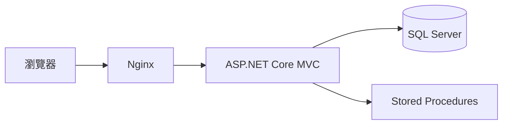

# 金融商品喜好清單系統

## 專案概述

本專案是使用 ASP.NET Core MVC 建置的金融商品喜好清單系統。  
系統支援帳號註冊/登入（Cookie Authentication）、Like List 新增/查詢/修改/刪除、資料隔離（只能操作自己的資料）、以及後端金額重算規則。

本專案提供：

- Docker Compose 一鍵啟動（`sqlserver + db-init + app + nginx`）
- 資料庫初始化腳本（`DB/DDL.sql`、`DB/DML.sql`、`DB/StoredProcedures.sql`）
- 以 Stored Procedure 為主的資料存取策略
- 基本測試專案（xUnit）

## 主要功能

- 帳號系統：註冊、登入、登出
- 權限控管：使用 `[Authorize]` 保護 Like List 頁面
- 喜好清單：新增、查詢、修改、刪除
- 商品選取：新增/編輯時可選擇商品並自動帶入 `Price/FeeRate`
- 後端重算：
  - `TotalAmount = Price * OrderQty`
  - `TotalFee = TotalAmount * FeeRate`
- 安全基線：
  - Cookie 驗證
  - Anti-forgery token
  - 參數化 SQL / Stored Procedure
  - Razor 預設輸出編碼

## 技術棧

- 後端：ASP.NET Core MVC（.NET 10）
- 資料層：SQL Server + Stored Procedures
- 基礎設施：Docker Compose + Nginx
- 測試：xUnit

## 系統架構



## 目錄結構

```txt
financial-product-likelist/
├─ FinancialProductLikelist.Web/     # ASP.NET Core MVC 主程式
├─ FinancialProductLikelist.Tests/   # xUnit 測試
├─ DB/                               # DDL / DML / StoredProcedures
├─ nginx/                            # Nginx 反向代理設定
├─ openspec/                         # 規格與變更文件（proposal/design/specs/tasks）
├─ docs/                             # 設計文件
└─ docker-compose.yml
```

## 安裝與啟動

### 方式一：Docker Compose（建議）

#### 前置需求

- Docker Desktop（Compose v2）

#### 啟動

```bash
docker compose up -d --build
```

此指令會：

1. 啟動 SQL Server
2. 執行 `db-init` 套用 `DB` 腳本
3. 啟動 ASP.NET Core 應用程式
4. 啟動 Nginx（對外 `8080`）

#### 服務網址

- 系統首頁（Nginx）：`http://localhost:8080`
- 登入頁：`http://localhost:8080/Account/Login`
- 註冊頁：`http://localhost:8080/Account/Register`
- Like List：`http://localhost:8080/LikeList`

#### 關閉

```bash
docker compose down
```

---

### 方式二：本機啟動（不使用 Docker）

#### 前置需求

- .NET SDK 10
- SQL Server 或 LocalDB

#### 1) 初始化資料庫

請依序執行：

1. `DB/DDL.sql`
2. `DB/StoredProcedures.sql`
3. `DB/DML.sql`

#### 2) 設定連線字串

檔案：`FinancialProductLikelist.Web/appsettings.json`

```json
{
  "ConnectionStrings": {
    "DefaultConnection": "Server=(localdb)\\MSSQLLocalDB;Database=FinancialProductLikeListDb;Trusted_Connection=True;MultipleActiveResultSets=true;TrustServerCertificate=True"
  }
}
```

#### 3) 啟動網站

```bash
dotnet run --project FinancialProductLikelist.Web/FinancialProductLikelist.csproj
```

## 使用說明

- 預設首頁為 `LikeList`（路由：`{controller=LikeList}/{action=Index}`）
- 未登入存取 LikeList 會導向 `/Account/Login`
- 建議先註冊新帳號，再登入使用

## 測試

```bash
dotnet test FinancialProductLikelist.Tests/FinancialProductLikelist.Tests.csproj
```

## 目前範圍（MVP）

- 帳號驗證流程（註冊/登入/登出）
- Like List CRUD 流程
- 商品選取 + 後端金額/手續費重算
- Docker 化本地開發環境

## 作者

- Dickson
