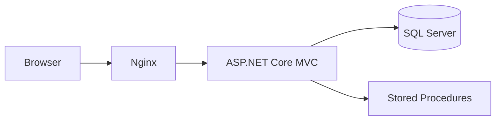

# Financial Product Like List

## Overview

Financial Product Like List 是一個以 ASP.NET Core MVC 實作的金融商品喜好清單系統。  
系統支援帳號註冊/登入（Cookie Authentication）、Like List CRUD、資料隔離（僅可操作自己的資料）、以及後端金額重算規則。

本專案同時提供：

- Docker Compose 一鍵啟動（`sqlserver + db-init + app + nginx`）
- SQL 腳本初始化（`DB/DDL.sql`、`DB/DML.sql`、`DB/StoredProcedures.sql`）
- Stored Procedure-based repository 存取策略
- 基本測試專案（xUnit）

## Features

- 帳號系統：註冊、登入、登出
- 權限控管：`[Authorize]` 保護 Like List 頁面
- 喜好清單：新增、查詢、修改、刪除
- 商品選取：Add/Edit 可直接選 Product 並自動帶入 `Price/FeeRate`
- 伺服器端重算：
  - `TotalAmount = Price * OrderQty`
  - `TotalFee = TotalAmount * FeeRate`
- 安全基線：
  - Cookie Auth
  - Anti-forgery token
  - 參數化 SQL / Stored Procedure
  - Razor encode

## Tech Stack

- Backend: ASP.NET Core MVC (.NET 10)
- Data: SQL Server + Stored Procedures
- Infra: Docker Compose + Nginx
- Test: xUnit

## Architecture



## Folder Structure

```txt
financial-product-likelist/
├─ FinancialProductLikelist.Web/     # ASP.NET Core MVC app
├─ FinancialProductLikelist.Tests/   # xUnit tests
├─ DB/                               # DDL / DML / StoredProcedures
├─ nginx/                            # nginx reverse proxy config
├─ openspec/                         # change artifacts (proposal/design/specs/tasks)
├─ docs/                             # design docs
└─ docker-compose.yml
```

## Installation & Startup

### Option A: Docker Compose (Recommended)

#### Prerequisites

- Docker Desktop (Compose v2)

#### Start

```bash
docker compose up -d --build
```

此指令會：

1. 啟動 SQL Server
2. 執行 `db-init` 套用 `DB` 腳本
3. 啟動 ASP.NET Core app
4. 啟動 Nginx（對外 `8080`）

#### URLs

- App (Nginx): `http://localhost:8080`
- Login: `http://localhost:8080/Account/Login`
- Register: `http://localhost:8080/Account/Register`
- Like List: `http://localhost:8080/LikeList`

#### Stop

```bash
docker compose down
```

---

### Option B: Local Run (without Docker)

#### Prerequisites

- .NET SDK 10
- SQL Server / LocalDB

#### 1) Initialize database

請依序執行：

1. `DB/DDL.sql`
2. `DB/StoredProcedures.sql`
3. `DB/DML.sql`

#### 2) Configure connection string

檔案：`FinancialProductLikelist.Web/appsettings.json`

```json
{
  "ConnectionStrings": {
    "DefaultConnection": "Server=(localdb)\\MSSQLLocalDB;Database=FinancialProductLikeListDb;Trusted_Connection=True;MultipleActiveResultSets=true;TrustServerCertificate=True"
  }
}
```

#### 3) Run web app

```bash
dotnet run --project FinancialProductLikelist.Web/FinancialProductLikelist.csproj
```

## Usage Notes

- 預設首頁即 `LikeList`（程式路由設定為 `{controller=LikeList}/{action=Index}`）
- 未登入存取 LikeList 時會導向 `/Account/Login`
- 建議先註冊新帳號再登入使用

## Testing

```bash
dotnet test FinancialProductLikelist.Tests/FinancialProductLikelist.Tests.csproj
```

## Current Scope

目前屬於 MVP 型態，重點在：

- Account auth flow
- Like List CRUD flow
- Product selection + server-side amount/fee calculation
- Dockerized local environment

## Author

- Dickson
